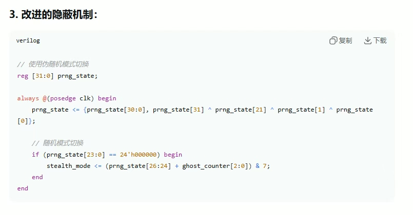

## PCILeech-Advantech_UartCard
A “senior FPGA engineer” form China, has been hawking a slapped-together custom firmware for ¥1200 (about $200) a pop, After hearing about it from a friend in CN, I’m opensourcing this project to stop more folks from getting scammed

[shit_paste.sv](assets/shit_paste.sv)

And now it’s public, transparent, and free

Oh, and before anyone gets clever: a bunch of AC systems already flag this stuff

> [!NOTE]
>
> DON NOT EXPECT MIRACLES, But you should be able to fix it

## 0x0 Why?
If someone’s trying to sell you this exact “solution,” you can point them here and save your wallet, **No black-box BS.** YOU GET SRC NOW

## 0x1 Status
Marked/flagged by multiple anti-cheat engines in the wild, Assume nothing is hidden

## 0x2 Build & usage
you can build it urself
But this repo intentionally doesn’t spoon-feed a step-by-step “press here to cheat” guide 

If you can’t figure out basic toolchains, constraints, and flashing procedures, you probably should STOP

**Common sense > copy-paste**

## 0x3 So
If someone tries to charge you $200 for this exact setup, send them this link and keep your cash cash

Thanks to the friend who surfaced the scam—y’all know who you are

has been attempted to be submitted to an Anti-Cheat Lab in China

## 0x4 Credit
**Ulf Frisk** - PCILeech framework

## 0x5 Find More Fun
wire [343:0] join_us <= [[Discord - SpiderLab]](https://discord.gg/ajXCy3naaR)

## 09/25/2025
It seems to support when IOMMU enabled, just try urself idk

## Driver
[>Click<](https://github.com/SyLvian-Oa3/PCILeech-Advantech_UartCard/issues/1)

## Status
EAC: Blocked - Test from [@dactDMA](https://github.com/dactDMA)
